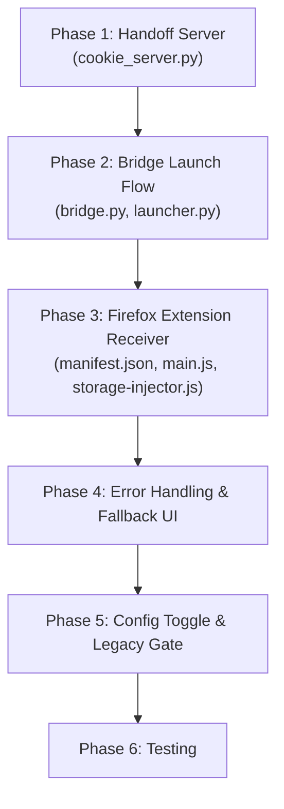

# Approach A Implementation Plan: Persistent Profile + Extension Companion

> Rework the Chromium → Firefox handoff to stop using broken direct SQLite injection and instead route state restoration through the existing Firefox extension via a tokenized localhost handoff page.

---

## Problem Summary

The current Chromium → Firefox flow fails because:
1. **Cookies**: Direct `cookies.sqlite` injection is silently rejected by modern Firefox (schema drift, WAL, integrity checks).
2. **Web Storage**: `localStorage`/`sessionStorage` are served on `127.0.0.1:47831/storage` but **nothing in the target Firefox instance ever fetches them**.
3. **Already-running Firefox**: `-no-remote -new-instance` + ephemeral profiles cause SQLite lock contention with an existing Firefox process.

## Solution Overview

Replace the broken direct-injection path with an **extension-mediated handoff**:

```
Chrome Extension → Bridge (Python) → Localhost Server (/handoff?token=UUID)
                                          ↓
                                   Firefox opens URL
                                          ↓
                              Firefox Extension intercepts
                                          ↓
                          Fetches payload → Sets cookies via API
                                          ↓
                          Navigates to target URL → Injects storage
```

---

## File Impact Matrix

| File | Change Type | Summary |
|------|-------------|---------|
| [`cookie_server.py`](file:///m:/.systemfile/ChromiumBridge/bridge/cookie_server.py) | **Major rewrite** | Add `/handoff?token=` endpoint serving full payload (cookies + storage + target URL). Add single-use token validation. Add auto-shutdown after fetch. Add fallback HTML page. |
| [`bridge.py`](file:///m:/.systemfile/ChromiumBridge/bridge/bridge.py) | **Modify** | Gecko branch: remove `stage_gecko_profile()` call (or gate behind legacy toggle), launch Firefox pointing at `http://127.0.0.1:47831/handoff?token=UUID` instead of target URL. Remove `-no-remote -new-instance` from gecko launch when not ephemeral. |
| [`launcher.py`](file:///m:/.systemfile/ChromiumBridge/bridge/launcher.py) | **Modify** | `build_gecko_flags()`: make `-no-remote -new-instance` conditional (only for ephemeral/legacy mode). Add new flag builder variant for companion mode. |
| [`firefox-extension/manifest.json`](file:///m:/.systemfile/ChromiumBridge/firefox-extension/manifest.json) | **Modify** | Add `"scripting"` permission (or use `tabs.executeScript` since MV2). Ensure `cookies` permission has `<all_urls>` host scope. Add `127.0.0.1` to content script matches. |
| [`firefox-extension/background/main.js`](file:///m:/.systemfile/ChromiumBridge/firefox-extension/background/main.js) | **Major addition** | Add handoff receiver logic: detect `127.0.0.1:47831/handoff` navigation, fetch payload, restore cookies via `browser.cookies.set()`, navigate to target, inject storage via content script. |
| [`firefox-extension/content/storage-injector.js`](file:///m:/.systemfile/ChromiumBridge/firefox-extension/content/storage-injector.js) | **New file** | Content script that receives `localStorage`/`sessionStorage` data from the background script and writes it into the page's storage objects. |
| [`bridge/config.json`](file:///m:/.systemfile/ChromiumBridge/bridge/config.json) | **Modify** | Add `"gecko_injection_mode": "companion"` (vs `"legacy"`) to `session` block. |
| [`cookies_gecko.py`](file:///m:/.systemfile/ChromiumBridge/bridge/cookies_gecko.py) | **No deletion** | Preserved as legacy fallback behind config toggle. No new code changes needed. |
| [`profile.py`](file:///m:/.systemfile/ChromiumBridge/bridge/profile.py) | **Minor** | No structural changes. Ephemeral creation still used for legacy mode only. |

---

## Task Breakdown

### Phase 1: Bridge-side — Tokenized Handoff Server
> **Goal**: The Python bridge serves a single-use `/handoff?token=UUID` endpoint that delivers the full state payload and then shuts down.

- [ ] **Task 1.1**: Rework [`cookie_server.py`](file:///m:/.systemfile/ChromiumBridge/bridge/cookie_server.py) — Add `/handoff` endpoint
  - Generate a `uuid.uuid4()` token per handoff session.
  - `GET /handoff?token=<UUID>` returns JSON: `{ "url": "...", "cookies": [...], "storage": {...}, "token": "..." }`.
  - Requests with a missing or wrong token get `403 Forbidden`.
  - After one successful fetch of `/handoff`, set a flag so the server auto-shuts down (via a threading event or by calling `server.shutdown()` from the handler thread).
  - `GET /handoff` (no token / wrong token) returns a **fallback HTML page** with:
    - Message: "ChromiumBridge extension is not installed or not active."
    - Link to install the Firefox extension.
    - Auto-retry JavaScript that polls `/handoff?token=...` every 2 seconds (in case the extension loads late).
  - Keep the existing `/cookies` and `/storage` endpoints intact for the Chromium companion flow.
  - Export a new `start_handoff_server(cookies, target_url, storage_data)` function that returns `(server, token)`.

- [ ] **Task 1.2**: Add auto-shutdown timeout to the server
  - Start a 30-second watchdog timer when the server starts.
  - If no successful `/handoff` fetch occurs within 30 seconds, shut down the server gracefully.
  - Cancel the watchdog if the payload is successfully fetched.

### Phase 2: Bridge-side — Launch Flow Changes
> **Goal**: The bridge launches Firefox pointing at the handoff URL instead of the target URL, and conditionally removes isolation flags.

- [ ] **Task 2.1**: Modify [`bridge.py`](file:///m:/.systemfile/ChromiumBridge/bridge/bridge.py) `handle_launch()` Gecko branch
  - Read `config.session.gecko_injection_mode` (default: `"companion"`).
  - **Companion mode** (new default):
    - Do NOT call `stage_gecko_profile()` (no SQLite injection).
    - Call `start_handoff_server(cookies, url, storage_data)` → get `(server, token)`.
    - Set `launch_url = f"http://127.0.0.1:{COOKIE_PORT}/handoff?token={token}"`.
    - Call `build_gecko_flags()` with a new `companion_mode=True` parameter.
  - **Legacy mode** (`"legacy"`):
    - Keep the existing flow exactly as-is (SQLite injection + direct URL launch).
  - Log the chosen mode in `bridge_debug.log`.

- [ ] **Task 2.2**: Modify [`launcher.py`](file:///m:/.systemfile/ChromiumBridge/bridge/launcher.py) `build_gecko_flags()`
  - Add `companion_mode=False` parameter.
  - When `companion_mode=True`:
    - Omit `-no-remote` and `-new-instance` (allow attaching to running Firefox).
    - Still include `-profile <dir>` only if the user explicitly specified a profile in config. Otherwise, omit it entirely so Firefox uses its default profile.
  - When `companion_mode=False` (legacy):
    - Keep existing behavior: `-profile <dir> -no-remote -new-instance`.

- [ ] **Task 2.3**: Update [`config.json`](file:///m:/.systemfile/ChromiumBridge/bridge/config.json) schema
  - Add `"gecko_injection_mode": "companion"` inside the `"session"` block.
  - Document the two values: `"companion"` (default, uses extension) and `"legacy"` (direct SQLite).

### Phase 3: Firefox Extension — Handoff Receiver
> **Goal**: The Firefox extension detects navigations to the handoff URL, fetches the payload, restores cookies, navigates to the target, and injects web storage.

- [ ] **Task 3.1**: Update [`firefox-extension/manifest.json`](file:///m:/.systemfile/ChromiumBridge/firefox-extension/manifest.json)
  - Ensure `"cookies"` permission is present (already is ✓).
  - Ensure `<all_urls>` host permission is present (already is, via `permissions` array ✓).
  - Add `http://127.0.0.1/*` to content script `matches` array (to allow detection on the handoff page).
  - No need for `"scripting"` — MV2 uses `browser.tabs.executeScript()`.

- [ ] **Task 3.2**: Add handoff receiver to [`firefox-extension/background/main.js`](file:///m:/.systemfile/ChromiumBridge/firefox-extension/background/main.js)
  - **Detection**: Use `browser.webNavigation.onCompleted` (or `browser.webRequest.onBeforeRequest`) to detect when a tab navigates to `http://127.0.0.1:47831/handoff*`.
  - Add `"webNavigation"` permission to manifest if using `onCompleted`.
  - **Payload Fetch**:
    - Extract the `token` query parameter from the URL.
    - `fetch("http://127.0.0.1:47831/handoff?token=<TOKEN>")` → parse JSON response.
    - On fetch failure or non-200, log warning and bail (user sees the fallback page).
  - **Cookie Restoration**:
    - Loop through `payload.cookies[]` and call `browser.cookies.set()` for each.
    - Map Chrome cookie format to the Firefox `cookies.set()` API:
      - `url`: Reconstruct from `cookie.secure ? "https://" : "http://"` + `cookie.domain.replace(/^\./, "")` + `cookie.path`.
      - `name`, `value`, `path`: direct passthrough.
      - `domain`: passthrough (Firefox handles leading dot correctly).
      - `secure`, `httpOnly`: direct passthrough.
      - `sameSite`: Map Chrome string (`"no_restriction"`, `"lax"`, `"strict"`, `"unspecified"`) to Firefox string (`"no_restriction"`, `"lax"`, `"strict"`, `"none"`).
      - `expirationDate`: passthrough (seconds since epoch).
      - `storeId`: Use `"firefox-default"` (or detect the current container).
    - Log the count of successfully set vs. failed cookies.
  - **Navigation**:
    - After cookies are set, redirect the tab to `payload.url` using `browser.tabs.update(tabId, { url: payload.url })`.
  - **Storage Injection**:
    - After the target page loads (listen for `browser.webNavigation.onCompleted` on the tab), inject storage.
    - Use `browser.tabs.executeScript(tabId, { code: "..." })` to write `localStorage` and `sessionStorage` into the page.
    - Alternatively, send a message to the content script `storage-injector.js` (see Task 3.3).

- [ ] **Task 3.3**: Create [`firefox-extension/content/storage-injector.js`](file:///m:/.systemfile/ChromiumBridge/firefox-extension/content/storage-injector.js) *(New file)*
  - Listen for `{ action: "injectStorage", localStorage: {...}, sessionStorage: {...} }` messages.
  - Write each key-value pair into `window.localStorage` and `window.sessionStorage`.
  - Send a response with the count of keys written.
  - Guard against `SecurityError` (e.g., opaque origins, `file://` pages).

- [ ] **Task 3.4**: Update the Firefox manifest to register the new content script
  - Add `"content/storage-injector.js"` to the content scripts array.
  - Or: load it dynamically via `browser.tabs.executeScript()` (avoids loading it on every page).
  - **Decision**: Use dynamic injection via `executeScript()` to avoid unnecessary overhead — only inject when a handoff is active.

### Phase 4: Error Handling, Security & Fallback UI
> **Goal**: Robust error handling, secure token validation, and a helpful fallback page for users without the extension.

- [ ] **Task 4.1**: Implement fallback HTML in [`cookie_server.py`](file:///m:/.systemfile/ChromiumBridge/bridge/cookie_server.py)
  - When `GET /handoff` is hit without the extension intercepting:
    - Serve an HTML page with:
      - Dark-themed styling consistent with the existing `"/"` page.
      - Message: "Waiting for ChromiumBridge extension..."
      - Spinner/animation.
      - JavaScript that polls `GET /handoff?token=<TOKEN>` every 2 seconds. On success, redirect to the target URL.
      - If the extension doesn't pick it up within 15 seconds, show a message: "Extension not detected. Please install ChromiumBridge for Firefox."
      - Link to the extension install page (AMO or local `.xpi`).

- [ ] **Task 4.2**: Secure the token
  - Use `secrets.token_urlsafe(32)` instead of `uuid.uuid4()` for stronger randomness.
  - Invalidate the token after first successful read (set `_token_consumed = True`).
  - Reject all subsequent requests to `/handoff` with that token.

- [ ] **Task 4.3**: Add `SameSite` cookie mapping edge cases
  - Chrome `"unspecified"` → Firefox `"no_restriction"` (not `"none"` — Firefox uses `"no_restriction"` as the equivalent).
  - Chrome `"no_restriction"` → Firefox `"no_restriction"`.
  - Handle missing `sameSite` field gracefully (default to `"no_restriction"`).

- [ ] **Task 4.4**: Handle cookie restoration errors gracefully
  - If `browser.cookies.set()` throws for a specific cookie (e.g., invalid domain), log the error and continue.
  - After all cookies, report: `"Set X of Y cookies successfully. Z failed."`.
  - If all cookies fail, show a notification to the user.

### Phase 5: Config Toggle & Legacy Preservation
> **Goal**: Allow users to fall back to the old SQLite injection if needed.

- [ ] **Task 5.1**: Add config toggle in [`bridge/config.json`](file:///m:/.systemfile/ChromiumBridge/bridge/config.json)
  - Add `"gecko_injection_mode": "companion"` to `session` block.
  - Values: `"companion"` (new, default) | `"legacy"` (old SQLite path).

- [ ] **Task 5.2**: Gate legacy code in [`bridge.py`](file:///m:/.systemfile/ChromiumBridge/bridge/bridge.py)
  - Read `gecko_injection_mode` from config at the top of the Gecko branch in `handle_launch()`.
  - If `"legacy"`: run existing `stage_gecko_profile()` + direct URL launch.
  - If `"companion"`: run new handoff server + handoff URL launch.
  - Log which mode was selected.

- [ ] **Task 5.3**: Preserve [`cookies_gecko.py`](file:///m:/.systemfile/ChromiumBridge/bridge/cookies_gecko.py) unchanged
  - Do NOT delete or modify this file. It remains the legacy fallback.
  - Only change: it stops being called by default (gated behind `"legacy"` mode).

### Phase 6: Testing & Validation
> **Goal**: End-to-end verification across cold start, warm start, and edge cases.

- [ ] **Task 6.1**: Manual test — Cold start (Firefox not running)
  - From Edge/Chrome/Brave, hand off a logged-in site to Firefox.
  - Verify Firefox launches, extension intercepts handoff URL, cookies are set, target page loads authenticated.
  - Verify `localStorage`/`sessionStorage` are present in the target page.

- [ ] **Task 6.2**: Manual test — Warm start (Firefox already running)
  - With Firefox already open, hand off from Chromium.
  - Verify a new tab opens in the existing Firefox window (no new instance).
  - Verify cookies and storage are restored correctly.

- [ ] **Task 6.3**: Manual test — Extension not installed
  - Launch Firefox without the extension installed.
  - Verify the fallback HTML page is shown with install instructions.
  - Verify the server auto-shuts down after 30 seconds.

- [ ] **Task 6.4**: Manual test — Legacy mode
  - Set `"gecko_injection_mode": "legacy"` in config.
  - Verify the old SQLite injection path is used.
  - Verify cookies are injected (even if they may not work on all Firefox versions).

- [ ] **Task 6.5**: Security test — Token reuse
  - After a successful handoff, try fetching `/handoff?token=<same-token>` again.
  - Verify it returns `403` (token consumed).

- [ ] **Task 6.6**: Security test — No token
  - Try accessing `http://127.0.0.1:47831/handoff` without a token.
  - Verify it returns the fallback page, not the payload.

---

## Execution Order



> [!IMPORTANT]
> Phases 1 & 2 can be developed and tested independently of Phase 3 by manually opening the handoff URL in a browser and inspecting the JSON payload. Phase 3 is where the actual cookie/storage restoration logic lives and requires the Firefox extension to be loaded.

---

## Key Design Decisions

1. **Dynamic script injection over static content script**: `storage-injector.js` will be injected via `browser.tabs.executeScript()` only during active handoffs, not registered as a static content script. This avoids loading unnecessary code on every page.

2. **`webNavigation.onCompleted` for detection**: More reliable than `webRequest` for detecting when the handoff page has loaded. The extension listens for completions matching `http://127.0.0.1:47831/handoff*`.

3. **Token = `secrets.token_urlsafe(32)`**: Cryptographically secure, URL-safe, and harder to guess than UUIDv4.

4. **No profile flag in companion mode**: When `companion_mode=True`, we omit `-profile` entirely so Firefox uses its default profile (where the extension is installed). The user's real profile gets the cookies.

5. **Server auto-shutdown**: The handoff server shuts down after the first successful payload fetch OR after a 30-second timeout. This prevents the port from being held indefinitely.

6. **Legacy preservation**: The SQLite injection code in `cookies_gecko.py` is untouched and gated behind a config flag, providing a rollback path.
