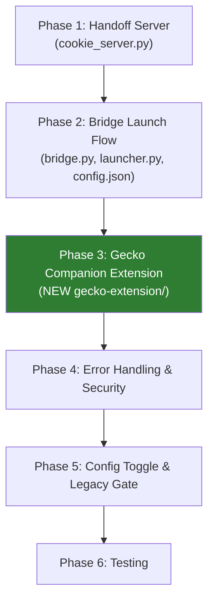

# Approach A — Revised Implementation Plan
# Separate Gecko Companion Extension + Tokenized Handoff Server

> **Key change from v1**: The existing `firefox-extension/` is **NOT modified**. A brand-new `gecko-extension/` companion is created, mirroring the architecture of `chromium-extension/`.

---

## Architecture — Extension Roles

| Directory | Role | Direction | Modified? |
|-----------|------|-----------|-----------|
| [`firefox-extension/`](file:///m:/.systemfile/ChromiumBridge/firefox-extension) | **Sender** — extracts state from Firefox, sends to Chromium | Firefox → Chromium | ❌ Untouched |
| [`chrome-extension/`](file:///m:/.systemfile/ChromiumBridge/chrome-extension) | **Sender** — extracts state from Chromium, sends to Firefox | Chromium → Firefox | ❌ Untouched |
| [`chromium-extension/`](file:///m:/.systemfile/ChromiumBridge/chromium-extension) | **Receiver** — companion injected into Chromium targets | Firefox → Chromium | ❌ Untouched |
| **`gecko-extension/`** *(NEW)* | **Receiver** — companion installed in Firefox, receives handoffs from Chromium | Chromium → Firefox | ✅ Created |

```
Chrome/Edge/Brave                                    Firefox (user's default profile)
┌──────────────────────┐                             ┌─────────────────────────────────┐
│  chrome-extension/   │                             │  gecko-extension/ (NEW)         │
│  (Sender MV3)        │                             │  (Receiver MV2)                 │
│                      │                             │                                 │
│  Extracts cookies,   │    Native Messaging          │  Detects handoff URL            │
│  localStorage,       │──────────────────────┐      │  Fetches payload from server    │
│  sessionStorage      │                      │      │  Sets cookies via API           │
│                      │                      ▼      │  Injects storage via script     │
│                      │            ┌─────────────┐  │  Shows "Back to Chrome" button  │
│                      │            │  Bridge.py   │  │                                 │
│                      │            │  (Python)    │──│  127.0.0.1:47831/handoff?token= │
│                      │            └─────────────┘  │                                 │
└──────────────────────┘                             └─────────────────────────────────┘
```

---

## File Impact Matrix

### New Files (all in `gecko-extension/`)

| File | Purpose |
|------|---------|
| `gecko-extension/manifest.json` | MV2 manifest with `cookies`, `storage`, `tabs`, `webNavigation`, `<all_urls>` permissions |
| `gecko-extension/background/receiver.js` | Detects handoff URL navigation, fetches payload, restores cookies via `browser.cookies.set()`, navigates to target, triggers storage injection |
| `gecko-extension/content/storage-injector.js` | Injects `localStorage`/`sessionStorage` into target origin after navigation |
| `gecko-extension/content/return-button.js` | Floating "Back to Chrome/Edge" button (mirrors `chromium-extension/content/return-button.js`) |
| `gecko-extension/icons/icon-48.png` | Extension icon (can reuse existing icons initially) |
| `gecko-extension/icons/icon-96.png` | Extension icon (can reuse existing icons initially) |

### Modified Files

| File | Change Type | Summary |
|------|-------------|---------|
| [`bridge/cookie_server.py`](file:///m:/.systemfile/ChromiumBridge/bridge/cookie_server.py) | **Major rework** | Add `/handoff?token=` endpoint, single-use token validation, auto-shutdown timer, fallback HTML page |
| [`bridge/bridge.py`](file:///m:/.systemfile/ChromiumBridge/bridge/bridge.py) | **Modify** | Gecko branch: gate `stage_gecko_profile()` behind legacy toggle, launch Firefox at handoff URL instead of target URL |
| [`bridge/launcher.py`](file:///m:/.systemfile/ChromiumBridge/bridge/launcher.py) | **Modify** | `build_gecko_flags()`: make `-no-remote -new-instance -profile` conditional on companion mode |
| [`bridge/config.json`](file:///m:/.systemfile/ChromiumBridge/bridge/config.json) | **Minor** | Add `"gecko_injection_mode": "companion"` to `session` block |

### Untouched Files

| File | Reason |
|------|--------|
| [`firefox-extension/*`](file:///m:/.systemfile/ChromiumBridge/firefox-extension) | Sender extension — completely untouched |
| [`chrome-extension/*`](file:///m:/.systemfile/ChromiumBridge/chrome-extension) | Sender extension — completely untouched |
| [`chromium-extension/*`](file:///m:/.systemfile/ChromiumBridge/chromium-extension) | Chromium receiver — completely untouched |
| [`bridge/cookies_gecko.py`](file:///m:/.systemfile/ChromiumBridge/bridge/cookies_gecko.py) | Preserved as legacy fallback, no changes |
| [`bridge/cookies.py`](file:///m:/.systemfile/ChromiumBridge/bridge/cookies.py) | Chromium companion injection — unchanged |
| [`bridge/profile.py`](file:///m:/.systemfile/ChromiumBridge/bridge/profile.py) | Still used for legacy ephemeral mode only |

---

## Task Breakdown

### Phase 1: Bridge-side — Tokenized Handoff Server
> Rework `cookie_server.py` to serve a single-use `/handoff?token=UUID` endpoint.

- [ ] **Task 1.1**: Add `/handoff` endpoint to [`cookie_server.py`](file:///m:/.systemfile/ChromiumBridge/bridge/cookie_server.py)
  - Generate a `secrets.token_urlsafe(32)` token per handoff session.
  - `GET /handoff?token=<TOKEN>` → JSON: `{ "url": "...", "cookies": [...], "storage": {...} }`.
  - Missing/wrong token → `403 Forbidden`.
  - After one successful fetch, mark token as consumed → reject subsequent requests.
  - Keep existing `/cookies`, `/storage`, `/` endpoints intact for the Chromium companion flow.
  - Export new function: `start_handoff_server(cookies, target_url, storage_data)` → returns `(server, token)`.

- [ ] **Task 1.2**: Add fallback HTML page
  - When `GET /handoff` is hit without the correct token (i.e. the extension hasn't intercepted):
    - Serve a dark-themed HTML page:
      - "Waiting for ChromiumBridge Companion extension..."
      - Spinner animation.
      - JavaScript that re-checks `/handoff?token=<TOKEN>` every 2 seconds.
      - After 15 seconds without success, show: "Extension not detected. Please install the ChromiumBridge Gecko Companion."
      - Include a direct download/install link.

- [ ] **Task 1.3**: Add auto-shutdown timeout
  - 30-second watchdog timer after server start.
  - Shuts down server if no payload fetch occurs.
  - Cancelled on successful fetch.

### Phase 2: Bridge-side — Launch Flow Changes
> Modify `bridge.py` and `launcher.py` so the Gecko branch launches Firefox at the handoff URL.

- [ ] **Task 2.1**: Modify [`bridge.py`](file:///m:/.systemfile/ChromiumBridge/bridge/bridge.py) Gecko branch in `handle_launch()`
  - Read `config["session"]["gecko_injection_mode"]` (default: `"companion"`).
  - **Companion mode** (new default):
    - Skip `stage_gecko_profile()` call.
    - Call `start_handoff_server(cookies, url, storage_data)` → `(server, token)`.
    - Set `launch_url = f"http://127.0.0.1:{COOKIE_PORT}/handoff?token={token}"`.
    - Pass `companion_mode=True` to `build_gecko_flags()`.
  - **Legacy mode** (`"legacy"`):
    - Existing flow unchanged (SQLite injection + direct URL).
  - Log chosen mode in `bridge_debug.log`.

- [ ] **Task 2.2**: Modify [`launcher.py`](file:///m:/.systemfile/ChromiumBridge/bridge/launcher.py) `build_gecko_flags()`
  - Add `companion_mode=False` parameter.
  - When `companion_mode=True`:
    - Omit `-profile <dir>`, `-no-remote`, `-new-instance`.
    - Firefox uses its default profile (where `gecko-extension/` is installed).
    - Still include window size flags for popup mode.
  - When `companion_mode=False`:
    - Keep existing behavior: `-profile <dir> -no-remote -new-instance`.

- [ ] **Task 2.3**: Update [`config.json`](file:///m:/.systemfile/ChromiumBridge/bridge/config.json)
  - Add `"gecko_injection_mode": "companion"` to the `"session"` block.

### Phase 3: Gecko Companion Extension — Scaffold & Cookie Receiver
> Create `gecko-extension/` with manifest, background receiver, and cookie restoration logic.

- [ ] **Task 3.1**: Create `gecko-extension/manifest.json`
  - Manifest V2 (for Firefox compatibility, mirroring `firefox-extension/`).
  - Permissions: `"cookies"`, `"storage"`, `"tabs"`, `"webNavigation"`, `"<all_urls>"`.
  - `browser_specific_settings.gecko.id`: new unique ID (e.g. `"chromiumbridge-companion@faisalbhuiyan.com"`).
  - Background script: `"background/receiver.js"`.
  - Content scripts: `"content/return-button.js"` at `document_idle`.
  - No static content script for storage injection (dynamically injected only during handoff).
  - Reuse icons from `firefox-extension/icons/`.

- [ ] **Task 3.2**: Create `gecko-extension/background/receiver.js`
  - **Handoff Detection**: Listen on `browser.webNavigation.onCompleted` for URLs matching `http://127.0.0.1:47831/handoff*`.
  - **Payload Fetch**:
    - Extract `token` from query string.
    - `fetch("http://127.0.0.1:47831/handoff?token=<TOKEN>")` → parse JSON.
    - On failure: log warning, bail (user sees fallback HTML page).
  - **Cookie Restoration**:
    - Loop through `payload.cookies[]`, call `browser.cookies.set()` for each.
    - Cookie format mapping (Chrome → Firefox `cookies.set()` API):
      - `url`: reconstruct from `(cookie.secure ? "https://" : "http://") + cookie.domain.replace(/^\./, "") + cookie.path`.
      - `name`, `value`, `path`, `domain`: passthrough.
      - `secure`, `httpOnly`: passthrough.
      - `sameSite`: map Chrome strings → Firefox: `"no_restriction"` → `"no_restriction"`, `"lax"` → `"lax"`, `"strict"` → `"strict"`, `"unspecified"` / missing → `"no_restriction"`.
      - `expirationDate`: passthrough (seconds since epoch).
      - `storeId`: `"firefox-default"`.
    - Log: `"Set X of Y cookies. Z failed."`.
  - **Navigation to Target**:
    - `browser.tabs.update(tabId, { url: payload.url })`.
  - **Storage Injection** (after target page loads):
    - Listen for `browser.webNavigation.onCompleted` on the same tab for the target URL.
    - Use `browser.tabs.executeScript(tabId, { code: <storage injection code> })` to write `localStorage` and `sessionStorage`.
    - The injected code receives the storage data via a closure or `JSON.stringify()` embedding.
    - Validate origin matches `payload.storage.origin` before writing.

- [ ] **Task 3.3**: Create `gecko-extension/content/return-button.js`
  - Port from [`chromium-extension/content/return-button.js`](file:///m:/.systemfile/ChromiumBridge/chromium-extension/content/return-button.js).
  - Change label: "Back to Chrome" / "Back to Edge" (or generic "Back to Chromium").
  - Change emoji: from 🦊 to the source browser's icon (or generic 🌐).
  - Use `browser.runtime` instead of `chrome.runtime`.
  - Use `browser.storage.local` instead of `chrome.storage.local`.
  - Shadow DOM isolation (same pattern as original).
  - Dismiss per-domain using `browser.storage.local`.

- [ ] **Task 3.4**: Copy icons
  - Copy `firefox-extension/icons/icon-48.png` and `icon-96.png` into `gecko-extension/icons/`.
  - (Or create distinct icons later to differentiate sender vs. receiver).

### Phase 4: Error Handling, Security & Edge Cases
> Hardening pass across all new code.

- [ ] **Task 4.1**: Secure the token in [`cookie_server.py`](file:///m:/.systemfile/ChromiumBridge/bridge/cookie_server.py)
  - Use `secrets.token_urlsafe(32)` (not `uuid.uuid4()`).
  - Set `_token_consumed = True` after first successful read.
  - Reject all subsequent `/handoff` requests with that token.

- [ ] **Task 4.2**: Handle cookie `sameSite` edge cases in `receiver.js`
  - Chrome `"unspecified"` → Firefox `"no_restriction"`.
  - Chrome `"no_restriction"` → Firefox `"no_restriction"`.
  - Missing `sameSite` field → default to `"no_restriction"`.
  - Handle cookies without `expirationDate` as session cookies (omit the field from `browser.cookies.set()`).

- [ ] **Task 4.3**: Handle cookie restoration errors gracefully
  - If `browser.cookies.set()` throws for a specific cookie, log and continue.
  - After all cookies, log summary: `"Set X of Y cookies. Z failed."`.
  - If ALL cookies fail, show console warning.

- [ ] **Task 4.4**: Handle storage injection errors
  - Guard against `SecurityError` for opaque origins.
  - Guard against `QuotaExceededError` for large storage payloads.
  - Validate origin before writing.

- [ ] **Task 4.5**: Handle warm-start (Firefox already running)
  - In companion mode, `-no-remote` is omitted.
  - Firefox will open a new tab in the existing window instead of spawning a new instance.
  - The `gecko-extension/` is already loaded in the running profile, so `webNavigation.onCompleted` fires immediately.
  - The bridge's `process.wait()` will return immediately since it didn't spawn a new process (Firefox exits the launcher immediately when attaching to existing instance).
  - **Bridge-side fix**: In companion mode, after launching, if process exits within < 2 seconds, assume warm-start. Do NOT clean up immediately — the handoff server must stay alive for the extension to fetch the payload. Wait for the server's auto-shutdown (payload consumed or 30s timeout) before returning the response.

### Phase 5: Config Toggle & Legacy Preservation
> Allow fallback to the old SQLite injection path.

- [ ] **Task 5.1**: Gate legacy code in [`bridge.py`](file:///m:/.systemfile/ChromiumBridge/bridge/bridge.py)
  - Read `gecko_injection_mode` from `config["session"]` at the top of the Gecko branch.
  - `"legacy"` → existing `stage_gecko_profile()` + direct URL + `-no-remote -new-instance`.
  - `"companion"` (default) → new handoff server + handoff URL + no isolation flags.
  - Log which mode was selected.

- [ ] **Task 5.2**: Preserve [`cookies_gecko.py`](file:///m:/.systemfile/ChromiumBridge/bridge/cookies_gecko.py) unchanged
  - No deletions or modifications. Called only when `gecko_injection_mode == "legacy"`.

### Phase 6: Testing & Validation

- [ ] **Task 6.1**: Manual test — Cold start (Firefox not running)
  - Hand off a logged-in site from Edge/Chrome/Brave.
  - Verify: Firefox launches → `gecko-extension/` intercepts → cookies set → target loads authenticated → storage injected → "Back to Chrome" button appears.

- [ ] **Task 6.2**: Manual test — Warm start (Firefox already running)
  - With Firefox open, hand off from Chromium.
  - Verify: new tab opens in existing Firefox → cookies/storage restored → authenticated.

- [ ] **Task 6.3**: Manual test — Extension not installed
  - Hand off without `gecko-extension/` installed in Firefox.
  - Verify: fallback HTML page shows with install instructions → server auto-shuts down after 30s.

- [ ] **Task 6.4**: Manual test — Legacy mode
  - Set `"gecko_injection_mode": "legacy"` in config.
  - Verify: old SQLite path is used.

- [ ] **Task 6.5**: Security — Token consumed after first use
  - After successful handoff, re-fetch `/handoff?token=<same-token>`.
  - Verify: `403 Forbidden`.

- [ ] **Task 6.6**: Security — No token
  - Access `http://127.0.0.1:47831/handoff` without token.
  - Verify: fallback page, not payload.

---

## Execution Order



> [!IMPORTANT]
> **Phase 3 is the biggest chunk** — it creates 4 new files from scratch. However, `receiver.js` and `return-button.js` are heavily based on the existing `chromium-extension/` equivalents, adapted for Firefox's MV2 APIs (`browser.*` instead of `chrome.*`).

---

## Key Design Decisions

1. **Separate companion extension** (`gecko-extension/`) instead of modifying `firefox-extension/`.
   - Clean separation: sender ≠ receiver.
   - Mirrors the existing pattern: `firefox-extension/` (sender) + `chromium-extension/` (receiver) for the Firefox→Chromium direction.
   - Users who only want Firefox→Chromium don't need the receiver. Users who only want Chromium→Firefox don't need the sender.

2. **MV2 for `gecko-extension/`** — Firefox's MV3 support is still evolving. MV2 with `browser.*` APIs is the stable, reliable choice and matches `firefox-extension/`.

3. **Dynamic storage injection** via `browser.tabs.executeScript()` — no static content script for storage. Only injected during active handoffs to avoid loading code on every page.

4. **Warm-start handling** — When Firefox is already running, the bridge process exits immediately. The server must stay alive independently until the payload is consumed or the 30s timeout fires.

5. **No profile flags in companion mode** — Firefox uses its default profile where `gecko-extension/` is installed. The user's real profile gets the cookies.

6. **`gecko-extension/` is NOT loaded via `--load-extension`** — Unlike `chromium-extension/` which is staged and loaded via CLI flags, `gecko-extension/` must be **manually installed** by the user into their Firefox profile (or loaded temporarily via `about:debugging`). This is because Firefox does not support `--load-extension` CLI flags.

---

## New Repository Layout (after implementation)

```
ChromiumBridge/
├── bridge/                    # Python native messaging host
├── firefox-extension/         # Firefox SENDER (Firefox → Chromium) — UNCHANGED
├── chrome-extension/          # Chromium SENDER (Chromium → Firefox) — UNCHANGED  
├── chromium-extension/        # Chromium RECEIVER (companion) — UNCHANGED
├── gecko-extension/           # Firefox RECEIVER (companion) — NEW ✨
│   ├── manifest.json
│   ├── background/
│   │   └── receiver.js
│   ├── content/
│   │   └── return-button.js
│   └── icons/
│       ├── icon-48.png
│       └── icon-96.png
├── scripts/
├── releases/
└── docs/
```
